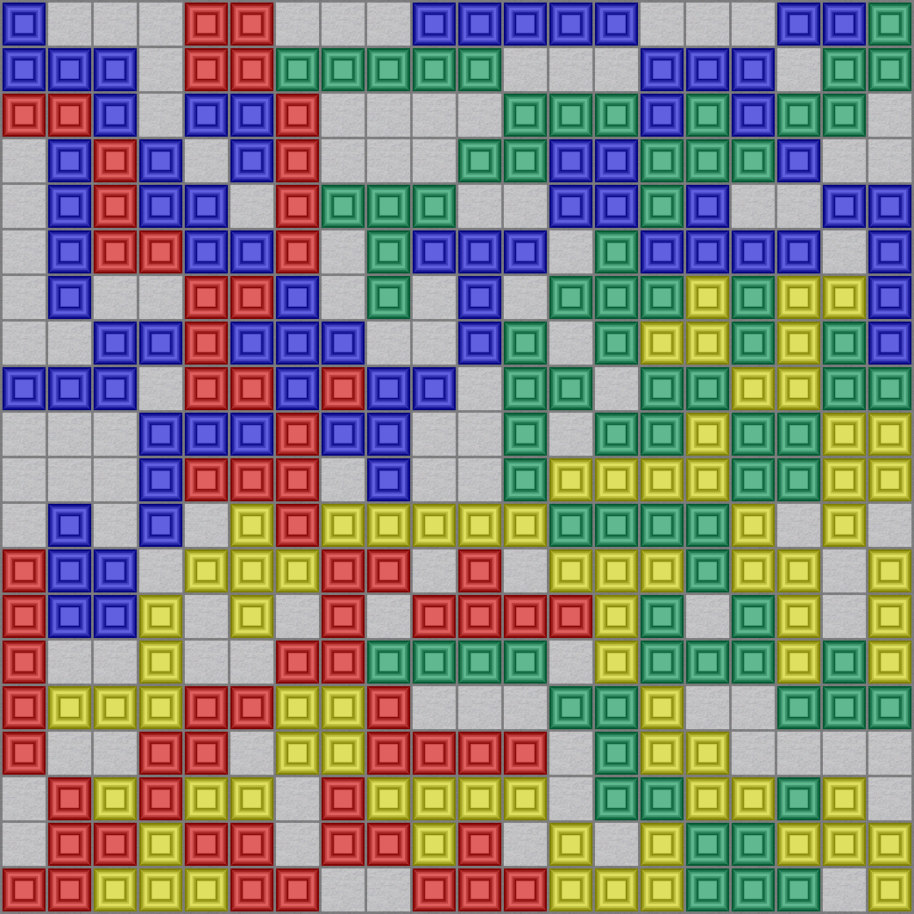
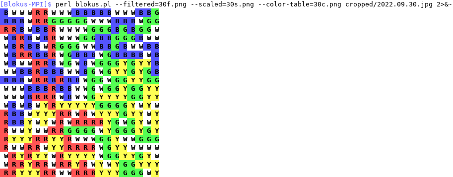
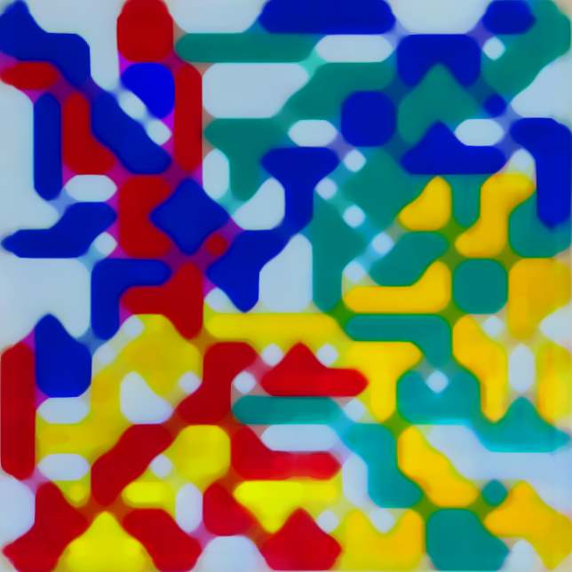
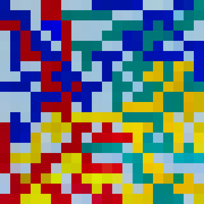
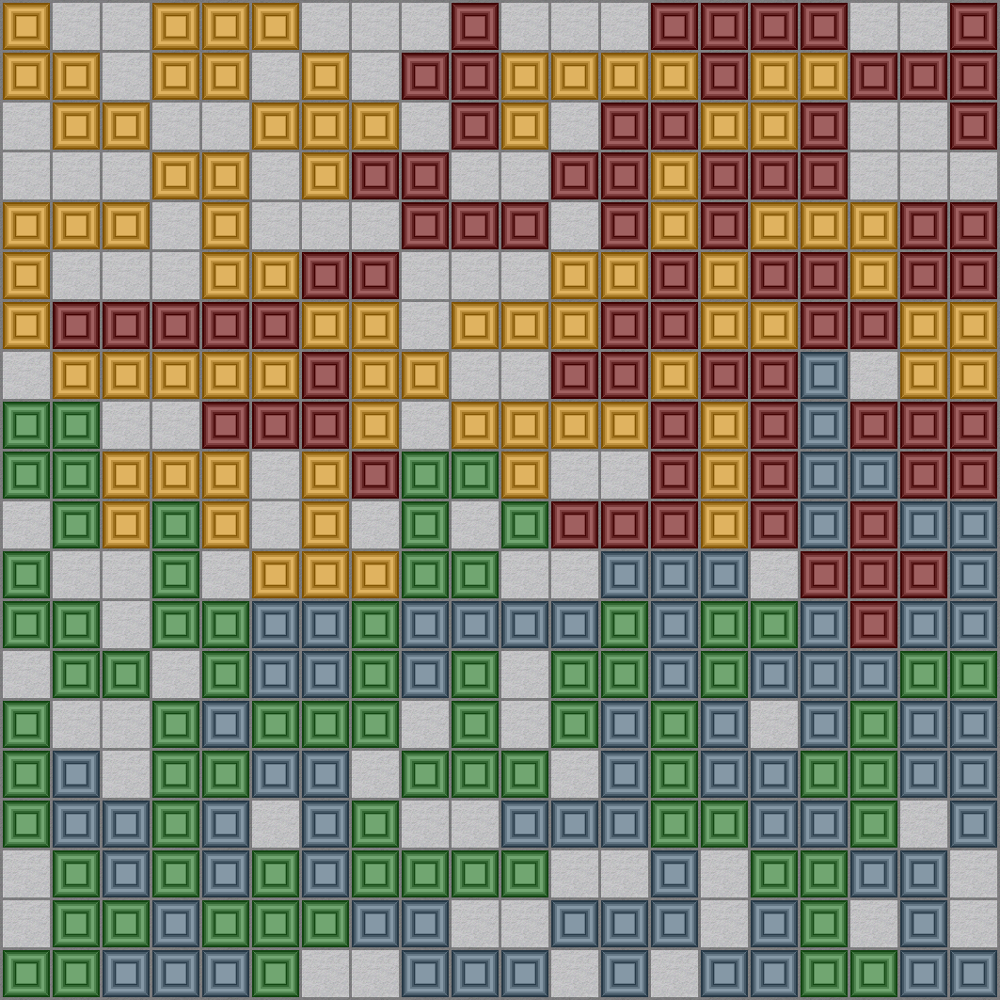

# Blokus-MPI

This project collects the boards of *Blokus* games played at the MPI MiS.

## How to add a new image

Photos of boards can be uploaded into the `raw` directory. The tiles are
shiny and reflect light. Please try to take the photo carefully with the
least amount of flare and under normal light. Name the photo with the date
it was taken in the format `yyyy.mm.dd` so that the photos sort correctly.

Photos from `raw` have to be preprocessed by hand before they can be handed
to the `blokus.pl` program. First, the Blokus board needs to be cut out of
the photo. For this I use the image editor Gimp. First rotate the image so
that the board is almost axes-parallel. Then use the *Crop* tool to crop
the  image to a small square around the board. Using the *Perspective* tool,
drag the corners of the board into the corners of the image. Iterate this
a few times for all four corners and it will stabilize. Click *Transform*
to apply the perspective transformation and *Flatten image*.

There is one blue block missing from our Blokus game and it is replaced by
a paper block that is green-ish. Use the *Color picker* to select some the
color from a blue tile on the image and just draw over the paper block.
Save that cropped and fixed version of the image in the `cropped` directory.
But keep the image open in Gimp because it may need furhter adjustments
if the `blokus.pl` script fails to detect some colors correctly.

I recommend to downscale the cropped board to at most 800x800 and to use
JPEG quality of 80% to save space before committing:

``` console
$ mogrify -strip -resize "800x800>" -quality 80 cropped/2022.09.30.jpg
```

The rest is taken care of by `blokus.pl`. It reads the cropped image,
detects the colors of tiles and synthesizes another, stylized image of
the board:

``` console
$ perl blokus.pl cropped/2022.09.30.jpg synth/2022.09.30.png
** Applying filters...
** Scaling down...
** Clustering colors...
** Color clustering delta = 1326.6066154714...
** Color clustering delta = 0...
** Output to file synth/2022.09.30.png
** Done!
```



The program can make mistakes, especially when there is a lot of flare
on the blocks! Please check that the output image is correct by comparing
it to the original. I do this by opening both images next to each other
and comparing the blocks one color at a time. Sometimes only single tiles
are wrong, so please pay attention!

The script is able to detect colors correctly most of the time. If a tile
has too much flare on it, it may be detected as white. That is the only
failure mode I have observed so far. It is sufficient to pick the color
the tile is supposed to be from a near-by tile and draw on the tile; then
save the image and rerun `blokus.pl`. Since this change of color on the
image may affect the color values learned by the script, you should
re-check all tiles. This can get annoying, so I usually run `blokus.pl`
once, take a quick glance at all the flares on the photo and fix them all
in one go. Then I run the script again and do one comparison.

After you have verified that the output is correct, record it:

``` console
$ perl blokus.pl cropped/2022.09.30.jpg 2>&- | tee t/2022.09.30.txt
BWWWRRWWWBBBBBWWWBBG
BBBWRRGGGGGWWWBBBWGG
RRBWBBRWWWWGGGBGBGGW
WBRBWBRWWWGGBBGGGBWW
WBRBBWRGGGWWBBGBWWBB
WBRRBBRWGBBBWGBBBBWB
WBWWRRBWGWBWGGGYGYYB
WWBBRBBBWWBGWGYYGYGB
BBBWRRBRBBWGGWGGYYGG
WWWBBBRBBWWGWGGYGGYY
WWWBRRRWBWWGYYYYGGYY
WBWBWYRYYYYYGGGGYWYW
RBBWYYYRRWRWYYYGYYWY
RBBYWYWRWRRRRYGWGYWY
RWWYWWRRGGGGWYGGGYGY
RYYYRRYYRWWWGGYWWGGG
RWWRRWYYRRRRWGYYWWWW
WRYRYYWRYYYYWGGYYGYW
WRRYRRWRRYRWYWYGGYYY
RRYYYRRWWRRRYYYGGGWY
```

This outputs a machine-readable version of the board and also puts it into
a text file which can be used for testing and hence to ensure that future
changes to the algorithms in `blokus.pl` do not make its recognition
abilities (on old boards) worse. To run the test suite, do

``` console
$ prove t
```

## Details of color recognition

The operation of `blokus.pl` is divided into three main steps and the data
produced by each intermediate step can be optionally output to files.
For more information about options to `blokus.pl`, call it with the `--help`
switch.

``` console
$ perl blokus.pl --filtered=30f.png --scaled=30s.png --color-table=30c.png cropped/2022.09.30.jpg 2>&-
```



If no output file is given and `blokus.pl` runs in a terminal, it prints
the above colored version of the board for quick inspection and enjoyment.

The first processing step applies heavy image filters to the input file.
They increase the saturation and clarity of colors as well as smudge out
flares in the photo. Concretely, this is a color grading, mean curvature
and median smoothing from [G'MIC]. The result of these filters is stored
in `30f.png`:



In the next step, the image is scaled down to 20x20 pixels without any
blurs or interpolation. We currently use Gimp's downscaling algorithm
for this because it produces a particularly nice pixelated result.



Normally, this image is truly 20x20 pixels but the version displayed above
has been upscaled for this documentation.

This step is inspired by [perceptual hashing]: since the board consists of
20x20 tiles of which we want to detect the colors and since the tiles are
aligned with the pixel grid, we may simply downscale the large and detailed
image to one pixel per tile. This pixel will have the perceptually dominant
color.

All that remains in the final step is to classify which pixel values are
which colors. On the Blokus board we expect exactly five colors: red, green,
blue, yellow and white (for tiles not covered by blocks). However, due to
perspective, the position of the light source or flare, two tiles that are
visually the same color may have quite different pixel values. Hence, we
employ a clustering algorithm to divide each of the 20x20 = 400 pixels into
exactly one of five clusters.

Concretely, we run [k-means clustering] with k = 5 cluster centers. This
algorithm is used to cluster points in Euclidean space by picking cluster
centers, grouping points to their closest center in Euclidean distance and
then updating the centers by averaging over each group. This process is
iterated until the centers stabilize.

When one thinks about pixels, one thinks about RGB channels, encoding
the mixing coefficients of red, green and blue that make up the color.
However, the RGB color space is not [perceptually uniform] in the Euclidean
distance and we also have mixed colors like yellow and white and the green
blocks in the Blokus game are closer to blue-green than pure-green. Thus,
some of our clusters are harder to separate than the others in the RGB
color space. Instead, we do clustering in the perceptually uniform
[L\*a\*b\*](https://en.wikipedia.org/wiki/CIELAB_color_space) color space.

When the clustering converges, all pixels are classified as red, green, blue,
yellow or white. This data is used to produce the textual or image output.
The cluster centers and hence the reference colors for the current image can
be exported (as `30c.png` in the command given above):


As you can see, in the `2022.09.30.jpg` file, white is rather blue. This is
not the case on other photographs, which is the reason why we use clustering
instead of (threshold-based) color detection.

[G'MIC]: https://gmic.eu
[perceptual hashing]: http://www.phash.org
[k-means clustering]: https://en.wikipedia.org/wiki/K-means_clustering
[perceptually uniform]: https://en.wikipedia.org/wiki/Color_appearance_model

### Color choice

Using the `-R`, `-G`, `-B`, `-Y`, `-W` switches, you can substitute the
colors from the original board with any colors you want. These colors are
parsed by ImageMagick, so you can use [a lot of formats](https://imagemagick.org/script/color.php).
Here is a vaguely autumn-themed board:

``` console
$ perl blokus.pl -R=maroon -G=ForestGreen -B=SkyBlue4 -Y=orange cropped/2022.10.10.jpg
```



### Dependencies

`blokus.pl` unfortunately has a list of relatively big dependencies.
The versions below do not indicate the required version, but the one I use
and is known to work:

- Perl v5.34
- Gimp v2.10.32
- G'MIC v3.1.6 using `update316.gmic` library
- Perl Image::Magick v7.0.1 with ImageMagick v7.1.0-48
- Perl modules of reasonably recent versions as in `cpanfile`

It would be really nice to shorten the list of image processing software
needed! Currently, Gimp is only required for its specific downscaling
algorithm which appears to neither blur nor interpolate. Using the algorithms
available in ImageMagick and G'MIC, I could not obtain results nearly as good.
